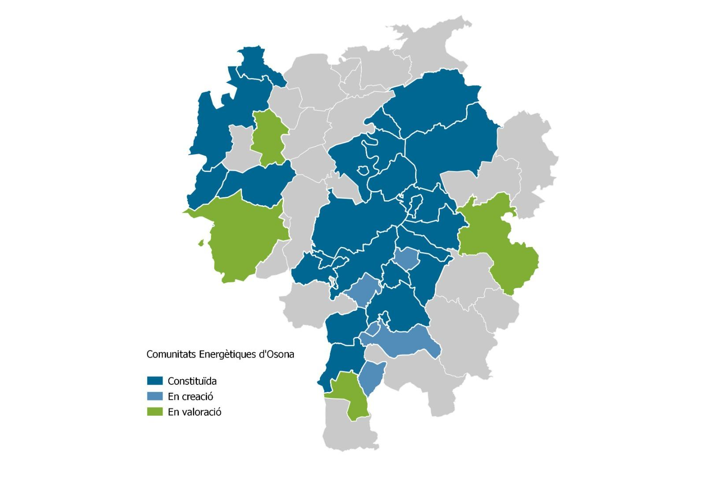

## Volem canviar el model energètic

Tenim un sistema energètic basat en els combustibles fossils que genera una gran quantitat de Gasos d'Efecte Hivernacle,
responsables de la crisi climàtica. Aquest sistema també depèn en gran mesura de fonts d'energia llunyanes en mans
de grans companyies sobre les que no tenim cap control. Creiem que podem ajudar a transformar aquesta situació, des
d'aquí i des d'ara.

Així neix la Cooperativa SEB En Transició SCCL, impulsada per un grup de veïns del poble, que vol impulsar la Transició Energètica a Santa Eugènia de Berga, promovent un canvi de model estalviador, renovable, en mans de la ciutadania i a
l'abast de tothom.

L’objectiu de la nostra cooperativa és treballar  amb iniciatives en diversos àmbits:

* En l’àmbit energètic, volem oferir energia 100% renovable, produïda i consumida localment i que
permeti assolir un estalvi en la factura dels nostres veïns i veïnes.
* En l’àmbit de la mobilitat, volem impulsar la compartició de vehicles elèctrics compartits i altres mitjans no contaminants.
* En l’àmbit de l’educació, informar sobre la importància de reduir el consum energètic i fomentar el consum local i responsable.

## Començarem creant comunitats energètiques

Les comunitats energètiques son un grup de persones que s'associen per produir energia conjuntament i
repartir-la entre ells. Pot prendre la forma d'una cooperativa, com en el nostre cas.
La seva finalitat és satisfer les necessitats energètiques de les persones
sòcies, mitjançant un model energètic just, viable econòmicament i sostenible
ambientalment.

L’autoproducció col·lectiva està prevista en el Reial Decret 244/2019.

## No estem sols!

A Osona, hi ha [més de 20 comunitats energètiques municipals](https://novaenergiaosona.cat/comunitats/) en funcionament:

Aquestes Cooperatives municipals ens hen agrupat en una cooperativa de segon grau anomenada Osona Energia SCCL (OECOOP), que serveix per coordinar-nos i abastir-nos de serveis que no podriem assumir per separat.

També comptem amb l’assessorament de l’Agència local de l’Energia d’Osona a través de [Nova Energia Osona](https://novaenergiaosona.cat/), i de l'[Ateneu Cooperatiu de la Catalunya Central](https://coopcatcentral.cat/).
