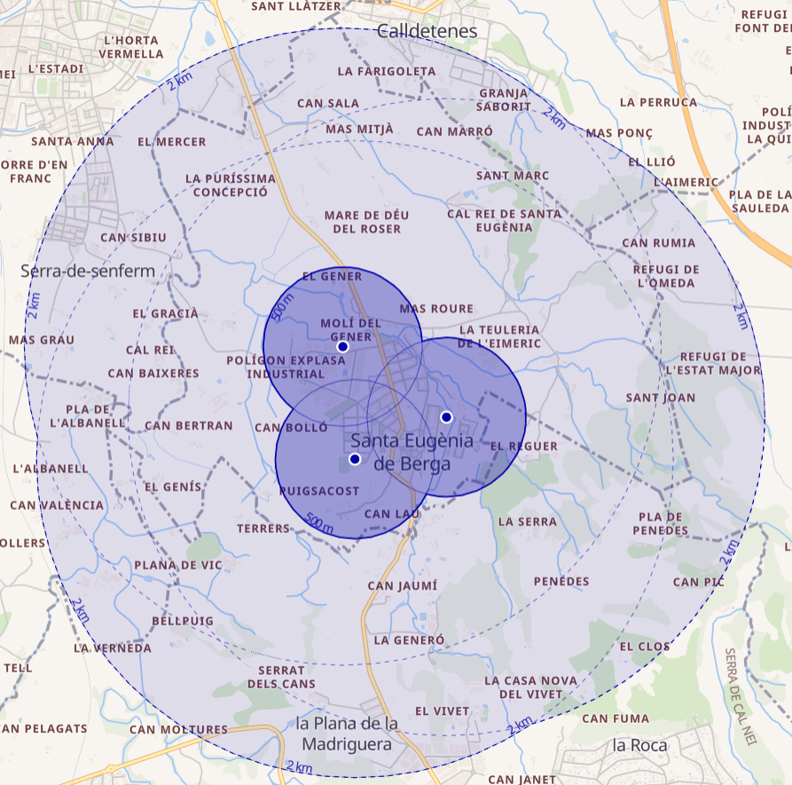

Actualment ens trobem en una fase d'estudi de tres possibles localitacions
que donarien cobertura pràcticament tot el terme municipal en un radi de 2 quilòmetres.

N'hem fet una memòria valorada de cadascuna per tal de calcular el seu
potencial i viabilitat, dels que us presentem les quatre dade bàsiques:

## Edifici de la Brigada, a la zona industrial

* Potencia nominal de 50 kW en orientacions Est-Oest
* Producció estimada de 77.000 kWh/any
* Reducció d'emissions de 25 TCO2/any
* Amortització de la inversió en 5 anys

## Gimnàs 1 d'Octubre, a la zona de l'escola

* Potencia nominal de 36 kW en orientació Sud
* Producció estimada de 60.000 kWh/any
* Reducció d'emissions de 19 TCO2/any
* Amortització de la inversió en 4 anys i mig

## Pavelló, a la zona esportiva

* Potencia nominal de 70 kW en orientació Nord
* Producció estimada de 100.000 kWh/any
* Reducció d'emissions de 33 TCO2/any
* Amortització de la inversió en 5 anys i 3 mesos

